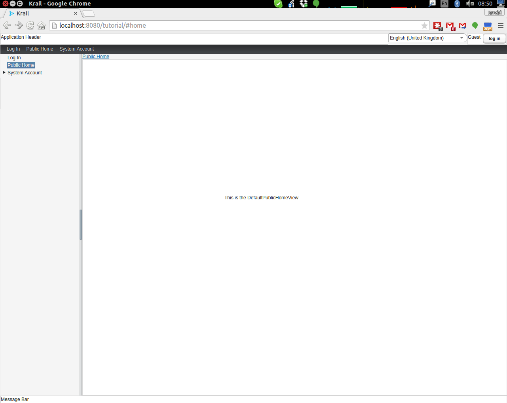
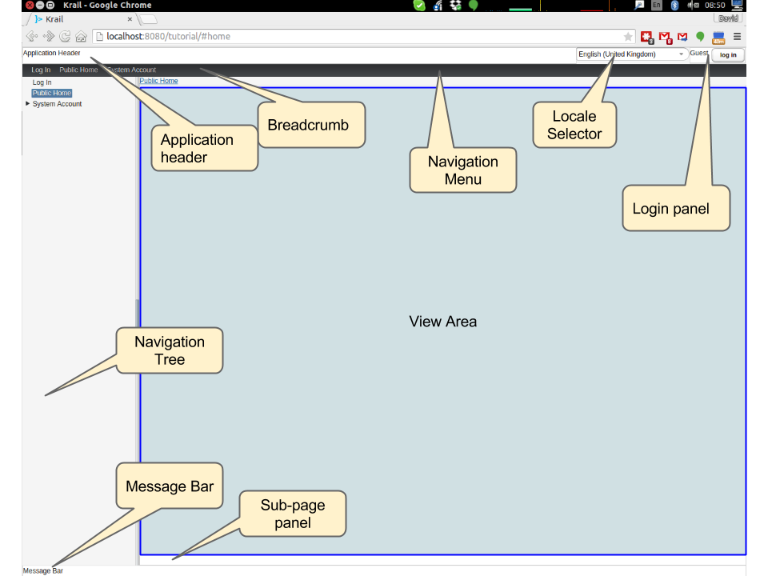

# Introduction

This Tutorial will take you through some of the basic steps of getting an application up and running, quickly, with Krail.

Krail encourages prototyping, by providing a lot of default functionality so that you can see early results.  Most of that functionality can then be modified or replaced.  The aim is to give the Krail developer the best of both worlds - quick results, but still the freedom to modify things however they wish.

# Creating a Krail application with Gradle

## Preparation
This tutorial assumes that you have Gradle already installed.  The Vaadin Gradle plugin used here requires Gradle 4+

It is also assumed that you will be using Git for version control, and have it installed.

Earlier versions of this tutorial code allowed a download at every step, but regrettably that proved time consuming to maintain.
  
You can, however, download the code for the entire [Tutorial from GitHub](https://github.com/davidsowerby/krail-tutorial)

## Create a build file

### Command Line

Change to your Git root directory, for example:
```
    cd /home/david/git
```
Create a directory for your project (called "**krail-tutorial**" in this case), and initialise it for git.
```
    mkdir krail-tutorial
    cd krail-tutorial
    git init
    gedit build.gradle
```
You will now have an empty build file open.  Cut and paste the following into the file & save it
```groovy
    plugins {
        id "com.devsoap.plugin.vaadin" version "1.2.0"
        id 'eclipse-wtp'  
        id 'idea'
    } 
  

    sourceCompatibility = '1.8'  

    repositories {  
        jcenter()  
    }  

    dependencies {  
        compile(group: 'uk.q3c.krail', name: 'krail', version: '0.10.0.1')
    }
    
    configurations.all {
        resolutionStrategy {
            // GWT requires an old version of the validation API.  Changing to a newer version breaks widgetset compile but throws no errors
            force 'javax.validation:validation-api:1.0.0.GA'
        }
    }
    
    task wrapper(type: Wrapper) {
        gradleVersion = '4.1'
    }
```  

- The first entry is for a [Vaadin Gradle plugin](https://github.com/johndevs/gradle-vaadin-plugin), and provides some valuable Vaadin specific Gradle tasks
- The 'eclipse' and 'idea' plugins are optional, but useful for generating IDE specific files.
- Krail requires Java 8, hence the line "sourceCompatibility = '1.8'"
- Of course, you cannot do without Krail ...
- There are a lot of dependencies involved in building Krail - that is no surprise, when you consider how many things it integrates.  However, that also means that there can be version conflicts to resolve, between the dependencies of the various component parts of Krail. The ResolutionStrategy is there to resolve those version conflicts. GWT requires an older version of the javax validation API - if you don't force the correct version to be used, then the widgetset compile will fail - and worse, it fails without any error messages.
- finally, the gradle-vaadin plugin needs Gradle at version 4+, so we will create a [Gradle wrapper](https://docs.gradle.org/current/userguide/gradle_wrapper.html) task 


Now save the file and add it to Git

```
git add build.gradle
```
And finally, create a Gradle wrapper:

```
gradle wrapper
```


## Create the Project

The Vaadin Gradle plugin makes things easier for us.  From the command line:

```sh
gradle vaadinCreateProject
```

## Import the Project to your IDE

### IDEA

- From the command line
```sh
gradle idea
```
- In IDEA, start the import

> File | Open and select *krail-tutorial/build.gradle*

- In the import dialog:

    - Ensure that JDK 1.8 is selected
    - Use "default gradle wrapper"
    - Select "Create directories for empty content roots automatically"

IDEA may prompt you to add the project VCS root - say yes if it does.


- Delete the src/main/groovy and src/test/groovy folders completely - we will only be using Java for this Tutorial.  There are a couple of generated files in these folders, but they can be deleted.

- To reduce what goes in to Git, let's just add a simple .gitignore file at the project root:

```
bin
build
classes
.gradle
.idea
```

- Right click on the project folder and select Git | Add to add all files to Git.

##Eclipse

Please see [this contribution](tutorial-eclipse.md)

## Krail preparation

### Guice and DI

This tutorial does not attempt to describe Guice, or Dependency Injection - which is what Krail is based on - but even if you are not familiar with either you may find that Krail is a good way to become so.  The [Guice documentation](https://github.com/google/guice/wiki/Motivation) is a very good introduction to the principles - and for reference, Krail uses [constructor injection](https://github.com/google/guice/wiki/Injections) with one or two specific exceptions.

### Setting up the application

Let's keep all the application configuration in one place and create a package under src/main/java:

   >com.example.tutorial.app
   
#### Create a Servlet
You may have noticed when you deleted the groovy folders, that a ```TutorialServlet``` had been generated.  We do need one, but not that one!

In the com.example.tutorial.app package, create a class ```TutorialServlet```, extended from ```BaseServlet```:
```java
package com.example.tutorial.app;
    
import com.google.inject.Inject;
import com.google.inject.Singleton;
import uk.q3c.krail.core.guice.BaseServlet;
import uk.q3c.krail.core.ui.ScopedUIProvider;

@Singleton
public class TutorialServlet extends BaseServlet {
    
    @Inject
    public TutorialServlet(ScopedUIProvider uiProvider) {
        super(uiProvider);
    }
}
```
#### Define a Widgetset
If you are familiar with Vaadin, you will be familiar with widgetsets.  However, if you are not, they can seem a bit of a mystery.  The [Vaadin documentation](https://vaadin.com/book/vaadin7/-/page/intro.html) is generally very good, but one thing which does not seem to be clear is when to use the in-built widgetset and when to specify your own.  We find it easier just to start by defining your own at the project set up stage.  To set this up, we need to modify the Servlet:

```java
@Singleton
public class TutorialServlet extends BaseServlet {
    
    @Inject
    public TutorialServlet(ScopedUIProvider uiProvider) {
        super(uiProvider);
    }
    
     @Override
    protected String widgetset() {
        return "com.example.tutorial.widgetset.tutorialWidgetset";
    }
}
```

and in the *build.gradle* file, add a vaadin closure to declare the widgetset.  (The plugin.logToConsole entry provides a little extra console output during a build.  It is useful, but not essential)

<div class="admonition note">
<p class="first admonition-title">Note</p>
<p class="last">Until issue #528 is resolved, the Vaadin version used by Krail has to be repeated here, and will need to be updated whenever the Krail version is updated, hence the comments</p>
</div>
    
```groovy
vaadin {
    widgetset 'com.example.tutorial.widgetset.tutorialWidgetset'
    plugin.logToConsole = true
}
```


#### Complete Build file

The full *build.gradle* file should look like this:

```
apply from: 'http://plugins.jasoft.fi/vaadin-groovy.plugin?version=0.10.6'
apply plugin: 'eclipse-wtp'
apply plugin: 'idea'

sourceCompatibility = '1.8'

repositories {
    jcenter()
}

dependencies {
    // remember to update the Vaadin version below if this version is changed
    compile(group: 'uk.q3c.krail', name: 'krail', version: '0.9.9')

}

vaadin {
    version = '7.6.3' // see issue https://github.com/davidsowerby/krail/issues/528
    widgetset 'com.example.tutorial.widgetset.tutorialWidgetset'
    plugin.logToConsole = true
}

configurations.all {
    resolutionStrategy {
        // GWT requires an old version of the validation API.  Changing to a newer version breaks widgetset compile but throws no errors
        force 'javax.validation:validation-api:1.0.0.GA'
    }
}

```


#### Create a Servlet Module

In the *com.example.tutorial.app package*, create a class ```TutorialServletModule```, extended from ```BaseServletModule```:
```
package com.example.tutorial.app;
   
import uk.q3c.krail.core.guice.BaseServletModule;

public class TutorialServletModule extends BaseServletModule {
   
   @Override
   protected void configureServlets() {
       serve("/*").with(TutorialServlet.class);
   }
}
```
#### Create a Binding Manager

In Krail terminology, the Binding Manager is a central point of Guice configuration.  Guice modules specify how things are bound together, and the Binding Manager selects which modules to use.  All Krail applications use their own Binding Manager, usually sub-classed from ```DefaultBindingManager```.  To create one for the tutorial:

In the com.example.tutorial.app package, create a class ```BindingManager```, extended from ```DefaultBindingManager```
```
package com.example.tutorial.app;

import com.google.inject.Module;
import uk.q3c.krail.core.guice.DefaultBindingManager;

import java.util.List;

public class BindingManager extends DefaultBindingManager {
  
    @Override
    protected void addAppModules(List<Module> baseModules) {
        
    }
    
    @Override
    protected Module servletModule() {
        return new TutorialServletModule();
    }
}
```

Notice that we override ```servletModule()``` to let Guice know about our ```TutorialServletModule```

#### Create web.xml
- Create a new directory, src/main/webapp/WEB-INF 
- Then create a *web.xml* file.  Note that the listener refers to our ```BindingManager.```  This could be the only xml you will use for the entire project

```xml
<?xml version="1.0" encoding="UTF-8"?>

<web-app xmlns:xsi="http://www.w3.org/2001/XMLSchema-instance" xmlns="http://java.sun.com/xml/ns/javaee"
         xsi:schemaLocation="http://java.sun.com/xml/ns/javaee http://java.sun.com/xml/ns/javaee/web-app_3_0.xsd"
         id="WebApp_ID" version="3.0">
    <display-name>Krail Tutorial</display-name>
    <context-param>
        <description>
            Vaadin production mode
        </description>
        <param-name>productionMode</param-name>
        <param-value>false</param-value>
    </context-param>


    <filter>
        <filter-name>guiceFilter</filter-name>
        <filter-class>com.google.inject.servlet.GuiceFilter</filter-class>
        <async-supported>true</async-supported>
    </filter>
    <filter-mapping>
        <filter-name>guiceFilter</filter-name>
        <url-pattern>/*</url-pattern>
    </filter-mapping>

    <listener>
        <listener-class>com.example.tutorial.app.BindingManager</listener-class>
    </listener>

</web-app>
```
#### Adding Some Pages

That's all the plumbing that is needed to get started - but we do not have any pages yet, so there's nothing to see.  We will take a shortcut for the Tutorial and use some that already exists - you will see how the relationship between Guice modules and pages could be very convenient for building modular applications.

The ```SystemAccountManagementPages``` class in Krail is a set of not very useful pages (it just meant as an example) composed as a Guice module.  We will add that module to the Binding Manager.  Note that we use the ```addSitemapModules()``` method - we could just add all modules in ```addAppModules(),``` the separation is purely for clarity.
```
    @Override
    protected void addSitemapModules(List<Module> baseModules) {
        baseModules.add(new SystemAccountManagementPages());
    }

```
The complete ```BindingManager``` now looks like:
```
package com.example.tutorial.app;

import com.google.inject.Module;
import uk.q3c.krail.core.guice.DefaultBindingManager;
import uk.q3c.krail.core.navigate.sitemap.SystemAccountManagementPages;

import java.util.List;

public class BindingManager extends DefaultBindingManager {

    @Override
    protected void addAppModules(List<Module> baseModules) {

    }

    @Override
    protected Module servletModule() {
        return new TutorialServletModule();
    }

    @Override
    protected void addSitemapModules(List<Module> baseModules) {
        baseModules.add(new SystemAccountManagementPages());
    }
}
```
#### Theme(s)
You could actually launch the Tutorial application now, but if you did it would look terrible - it has no CSS applied.  To give the application some style we need to apply a Vaadin theme.  It is possible to use themes from the Vaadin theme jar,  but it is advisable to extract them and serve them statically, as recommended by the [Vaadin documentation](https://vaadin.com/book/-/page/themes.creating.html#themes.creating.builtin):
 
> *The built-in themes included in the Vaadin library JAR are served dynamically from the JAR by the servlet. Serving themes and widget sets statically by the web server is more efficient.* 

So let's do that now.
 
- Find the vaadin-themes.jar.  The easiest way is to search the {$user.home}/gradle directory - it should have been downloaded with the other Vaadin jars.  If for any reason it is not there, you can download it from JCenter or Maven Central
- extract the jar
- locate the theme folders - you will find them in the VAADIN/themes folder
- copy folders for the themes you want - for the Tutorial, just copy all of them - into src/main/webapp/VAADIN/themes.

For readers less familiar with Vaadin, "reindeer" is the default style, and "valo" is the most recent.

#### Build and Run

The one aspect of the build that tends to give problems is the widgetset compile - it seems very sensitive.  We therefore suggest compiling it first by executing:


>  gradle vaadinCompileWidgetset


from either the command line or IDE.  You can see whether it has compiled by checking the src/main/webapp/VAADIN/widgetsets folder - it should have contents.  (A compile failure usually creates a widgetsets folder, but leaves it empty)

We can now build and run the application - set up a run configuration in your IDE to take the war output and run it on Tomcat or whichever application server you are using:

####Run Configuration in IDEA

>Run | Edit Configurations<br>
  + | Tomcat Server | Local<br>
Name: Tutorial<br>
Deployment: + | artifact | tutorial.war<br>
Application context: /tutorial

- refresh Gradle
- Build | Rebuild project
- Run Tutorial

####Run Configuration in Eclipse

> tbd

 .... you should now see something like this:


<a name="explore"></a>
#Exploring the Basic Application

There are a few things to see, even in this very basic implementation.    




- The "screen" presentation is provided by ```DefaultApplicationUI``` - UI in this context refers to the Vaadin concept of UI, which is generally equivalent to a browser tab. 
- ```DefaultApplicationUI``` contains a number of components and both the UI and its components can be replaced, sub-classed or modified.  All the parts described below are pluggable components, held by the UI: 
	- The Application Header is just a panel to hold things like logos
	- The navigation tree, navigation menu, breadcrumb and sub-page panel menu are all navigation-aware components.   You can navigate pages by clicking on any of them, or just change the URL directly.  These navigation components are tied to a Sitemap,  which defines the structure of the site, and the Views used to represent each page.  You will see how this works when we create some new pages.
	- The Locale selector will not do much yet, as there are no alternative Locales defined - that will be covered later in the Tutorial.
	- The login panel offers a login button and a login status - we will log in in a moment
	- The message bar is just a place for messages to the user.
	- The View area (in blue) is where all the work is done - it is here that you will put forms and tables etc.
 
Of course, as a developer, you will almost certainly have logged in by now, but in case you have not - you can use any user name, and a password of "password", so that you can pretend to be a real user with a memorable password ...

A couple of things have changed now you have logged in:

- You will no longer be on the login page - that's a bit obvious, but it is worth noting that even the rules for where to navigate to after log in is a replaceable element. 
- There is now an extra page in the navigation components, called 'Private' - this represents a restricted area of the site, where only authorised users can have access.  The other pages are all "public".
- The login panel shows your user name, and now offers a "logout" button.

This is achieved using two major components, the ```DefaultRealm``` (a very simple implementation of the Apache Shiro Realm) and the ```PageController```, which is a Krail component used to control the display of pages authorised by your Realm implementation.  We will come back to these when we look at [User Access Control](tutorial-uac.md).

Now try this sequence:

- Login
- Click on "Private" and you will see that it jumps to "Private home" - this is configurable behaviour - it is a redirect so that there does not need to be a view if the "Private" page itself will never be shown
- Logout.  You will now be on the logout page (which by default does not appear in the navigation components - also configurable behaviour)
- Press the browser 'back' button - and a notification will pop up saying that *"private/home is not a valid page"*.  Even though you know this is not the case, this message is deliberate, as it means that if a user tries to guess a url that they are not authorised for, they will not even get confirmation that the page exists. 
- Look at the message bar and you will see that the same message has appeared there.  We will look at [user notifications](tutorial-user-notification.md) and how they are handled a bit later.

#Summary
You have created a basic application, and can have already seen:<br>

- Integration with User Access Control from Apache Shiro
- a pluggable set of pages
- Navigation aware components acting together
- User notifications

# Download from GitHub

To get to this point straight from GitHub, [clone](https://github.com/davidsowerby/krail-tutorial) using branch **step01**
    


